# Text Flappy Bird RL Project

This project studies how far tabular reinforcement learning can go on a text/grid Flappy Bird environment, then improves screen-based learning with a discretized autoencoder state representation.

The full workflow and experiments are in [test.ipynb](test.ipynb).

## Environments

- `TextFlappyBird-v0`: compact state (distance-style, no raw screen).
- `TextFlappyBird-screen-v0`: full screen observation.

The environment is adapted from [flappy-bird-gym](https://github.com/Talendar/flappy-bird-gym).

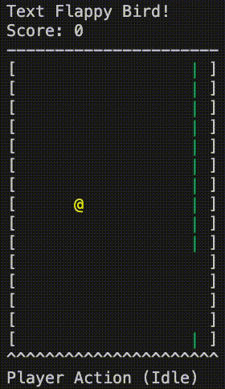

## Setup

```bash
pip install -e .
```

Quick check:

```python
import gymnasium as gym
import text_flappy_bird_gym

env = gym.make('TextFlappyBird-v0', height=15, width=20, pipe_gap=4)
obs, _ = env.reset()
print(type(obs), obs)
env.close()
```

## Experimental Pipeline

1. Train no-screen Monte Carlo and SARSA baselines.
2. Train Monte Carlo directly on raw screen states (tabular key = flattened frame).
3. Train and sweep autoencoders to get discretized latent state codes.
4. Pick a practical state budget near $8\text{k}$ states.
5. Train Monte Carlo on encoded screen states and compare against raw-screen baseline.

## Key Findings

- No-screen tabular agents are strong and stable with enough episodes.
- Raw-screen Monte Carlo improves only modestly because state space is huge.
- Autoencoder integer reconstruction quality is mostly governed by effective number of states.
- The best full sweep setup by integer loss reaches about `0.0131` (`linear_then_conv`, latent_dim=8, hidden_dim=512, latent_scale=16).
- Under a tabular-friendly state budget, `latent_scale=20`, `latent_dim=3` ($20^3=8000$ states) gives a good trade-off (`best_int_loss ≈ 0.0496`).
- Encoded-screen Monte Carlo significantly outperforms raw-screen Monte Carlo in long training.

## Results Gallery (All Plot Assets)

### RL Baselines

No-screen Monte Carlo (100k episodes):

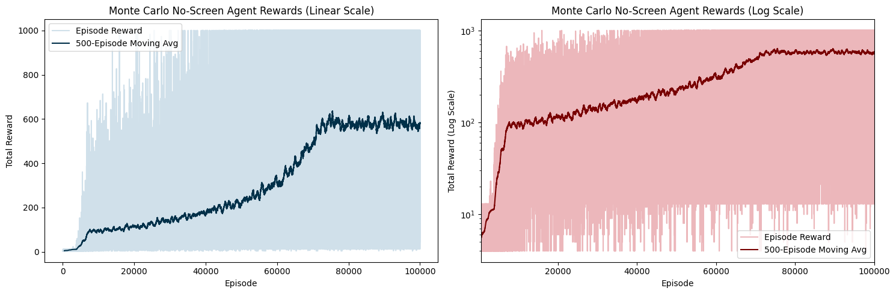

No-screen Monte Carlo tuned run:

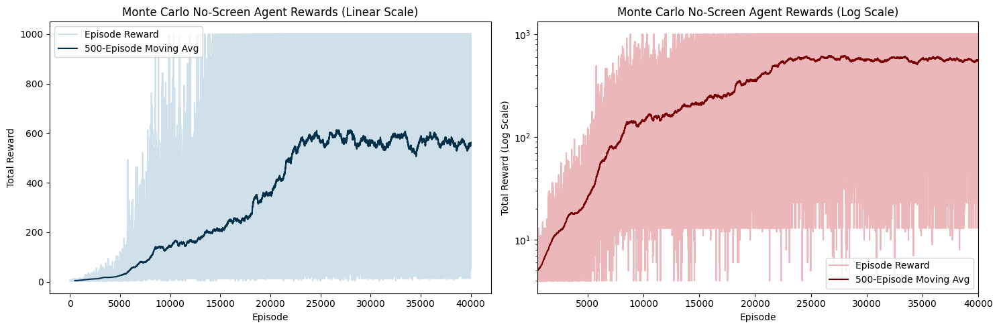

No-screen SARSA:

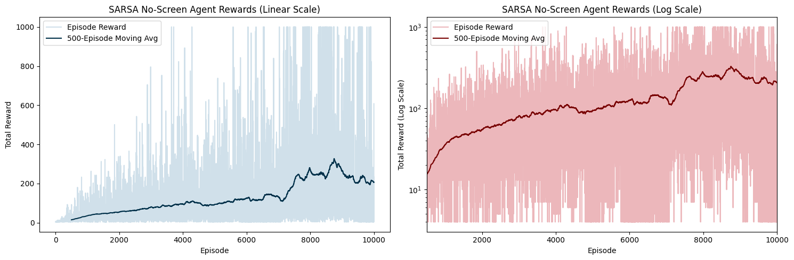

Screen Monte Carlo on raw observations:

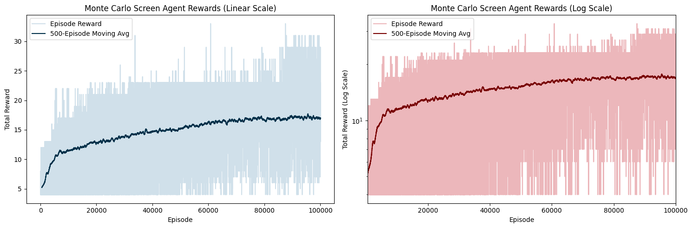

Screen Monte Carlo with encoded states:

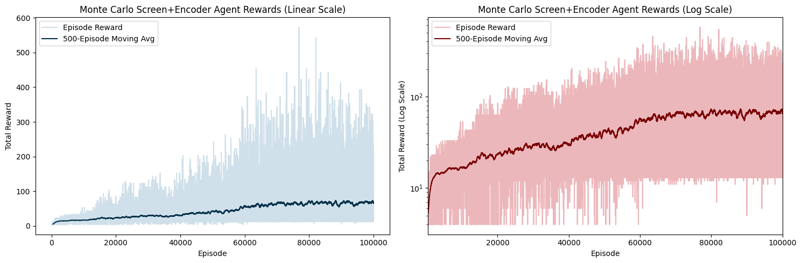

### Hyperparameter Analysis

No-screen MC one-at-a-time sensitivity:

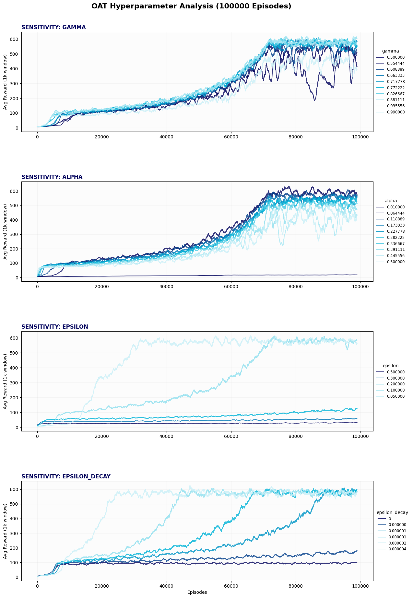

Autoencoder sweep trends:

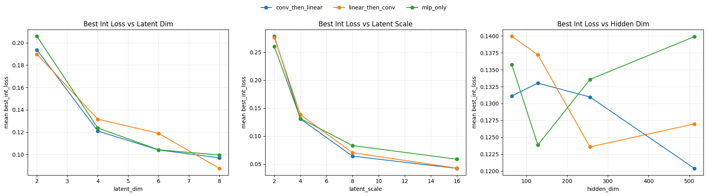

Autoencoder best loss trends:

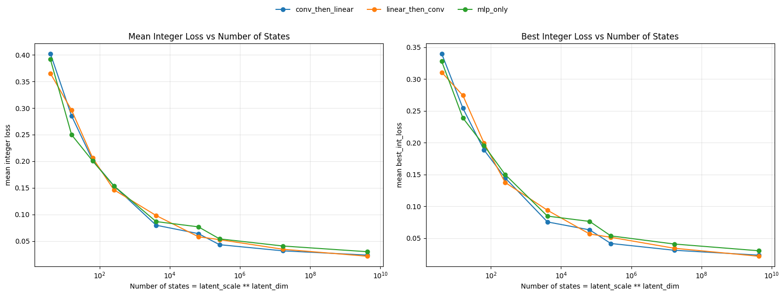

Loss versus number of states:

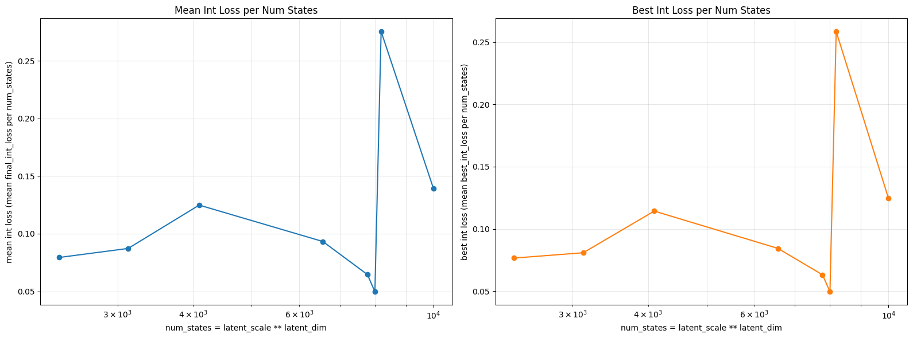

Latent scale/dim state decomposition:

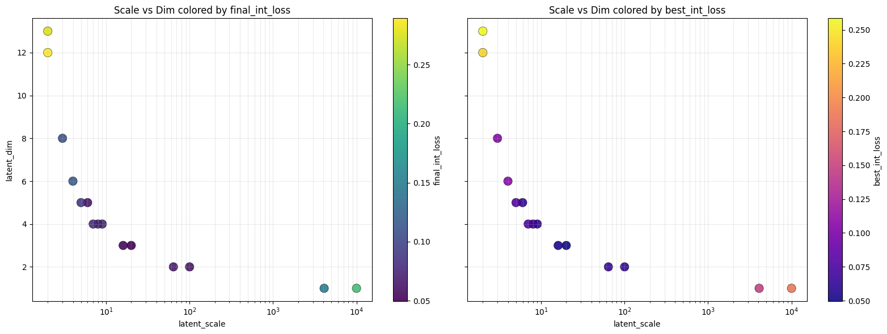

### Latent Reconstruction Dynamics

Animated latent-to-reconstruction visualization:


## Data Artifacts

- [plots/ae_sweep_results.csv](plots/ae_sweep_results.csv): full AE grid results.
- [plots/ae_selected_state_scale_combinations.csv](plots/ae_selected_state_scale_combinations.csv): focused state-budget experiments.
- [plots/vq_grid_results_summary.csv](plots/vq_grid_results_summary.csv): VQ-AE grid summary.
- [plots/vq_grid_best_config.json](plots/vq_grid_best_config.json): best VQ config snapshot.

## Repository Layout

- [test.ipynb](test.ipynb): main experiment notebook.
- [text_flappy_bird_gym/](text_flappy_bird_gym/): gym environments.
- [check_model.py](check_model.py), [check_ns_model.py](check_ns_model.py): model checks.
- [main.py](main.py): script entrypoint.
- [plots/](plots/): exported figures and tables.

## Notes

- Long runs (up to 100k episodes and large sweeps) are compute-intensive. 10 hours +
- Notebook cell order matters because later stages reuse trained models and cached artifacts.

